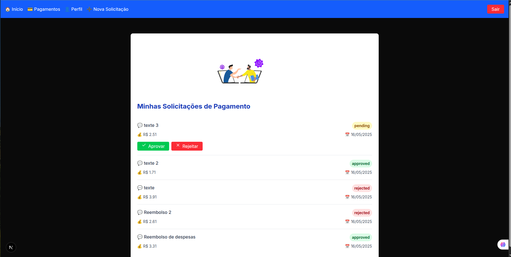
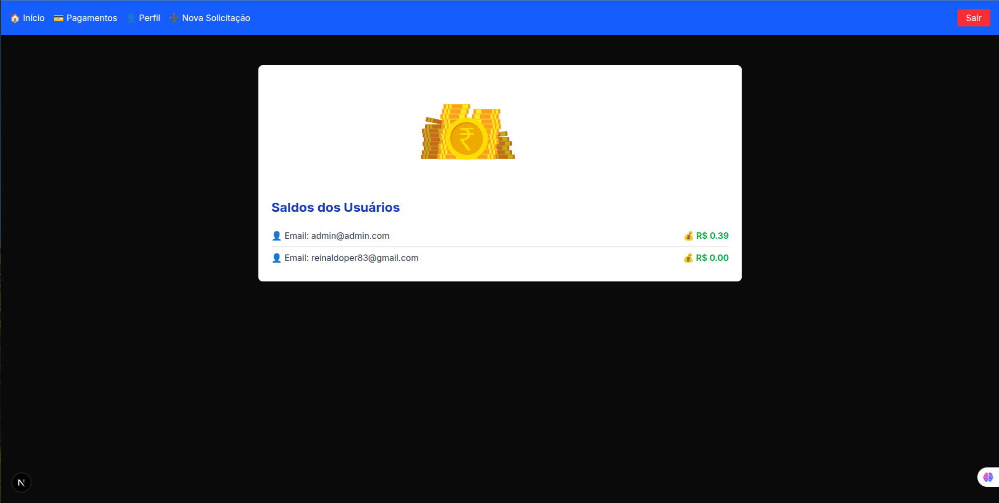

# Carteira digital

Este projeto é um painel de usuário desenvolvido com **Next.js 13+**, utilizando **Firebase Authentication** e **Cloud Firestore** para login e exibição de saldo da carteira do usuário.

---

[](https://app.netlify.com/projects/meios-de-pagamentos/deploys)


---

## Como funcionam as aprovações de pagamento em carteiras digitais

1. Em sistemas de carteira digital, o admin normalmente tem funções de gestão, auditoria e controle das transações, podendo aprovar ou rejeitar pagamentos feitos por usuários.

2. O admin pode ter uma conta própria na plataforma, mas, em muitos casos, ele atua apenas como aprovador.

3. O usuário solicita um pagamento (payment-request).

4. O sistema verifica se o usuário tem saldo suficiente para cobrir o valor solicitado.

5. Se o saldo for suficiente, a requisição é criada com status pending e aguarda a aprovação do admin.

6. O admin então revisa a solicitação e pode aprovar (accept) ou rejeitar (reject) a transação.

---

## 🔥 Funcionalidades

- Login com Firebase Authentication
- Verificação automática de sessão ativa
- Consulta do saldo da carteira no Firestore
- Logout com limpeza de sessão
- UI moderna com Tailwind CSS
- Ícone de logout com `react-icons`

---

## 🚀 Tecnologias utilizadas

- [Next.js](https://nextjs.org/)
- [Firebase Authentication](https://firebase.google.com/products/auth)
- [Cloud Firestore](https://firebase.google.com/products/firestore)
- [Tailwind CSS](https://tailwindcss.com/)
- [React Icons](https://react-icons.github.io/react-icons)
- NodeJs >=18

---

### Esttrutura do projeto

```bash
├── public
│   ├── animations
│   │   ├── login.json
│   │   ├── panel.json
│   │   ├── payment.json
│   │   ├── profile.json
│   │   ├── register.json
│   │   └── request.json
│   ├── file.svg
│   ├── globe.svg
│   ├── next.svg
│   ├── vercel.svg
│   └── window.svg
├── README.md
├── serviceAccountKey.json
├── src
│   ├── app
│   │   ├── dashboard
│   │   │   ├── admin
│   │   │   ├── layout.tsx
│   │   │   ├── page.tsx
│   │   │   ├── payments
│   │   │   ├── perfil
│   │   │   ├── request
│   │   │   └── wallet
│   │   ├── favicon.ico
│   │   ├── globals.css
│   │   ├── layout.tsx
│   │   ├── login
│   │   │   └── page.tsx
│   │   ├── logout
│   │   │   └── route.ts
│   │   ├── page.tsx
│   │   ├── register
│   │   │   └── page.tsx
│   │   └── types
│   │       └── types.ts
│   ├── lib
│   │   ├── auth.ts
│   │   ├── firebase.ts
│   │   └── firestore.ts
│   ├── middleware.ts
│   └── pages
│       └── api
│           └── set-admin.ts
├── tsconfig.json
└── yarn.lock
```

---

## 📦 Instalação

1. **Clone o repositório**

```bash
git clone https://github.com/reinaldoper/meios-pagamentos.git
cd meios-pagamentos
npm install
```

---

2. Crie e configure o Firebase

- Acesse console.firebase.google.com

- Crie um novo projeto

- Ative Authentication com o método de e-mail/senha

---

3. 🔐 Configuração do Firebase no projeto
- Crie um arquivo .env.local com suas variáveis do Firebase:

```env

NEXT_PUBLIC_FIREBASE_API_KEY=...
NEXT_PUBLIC_FIREBASE_AUTH_DOMAIN=...
NEXT_PUBLIC_FIREBASE_PROJECT_ID=...
NEXT_PUBLIC_FIREBASE_STORAGE_BUCKET=...
NEXT_PUBLIC_FIREBASE_MESSAGING_SENDER_ID=...
NEXT_PUBLIC_FIREBASE_APP_ID=...
NEXT_PUBLIC_BASE_URL=http://localhost:3000
PROJECT_ID=...
PRIVATE_KEY_ID=...
PRIVATE_KEY=...
CLIENT_EMAIL=...
CLIENT_ID=...
AUTH_URI=...
TOKEN_URI=...
AUTH_PROVIDER_CERT_URL=...
CLIENT_CERT_URL=...
UNIVERSE_DOMAIN=...
NODE_ENV=production

```
---

4. 🔥 Integrações com Firestore
- users/{uid} → Documento contendo email, createdAt

- wallets/{uid} → Documento com balance do usuário

- (Em progresso) payments/{id} → Dados de pagamentos realizados

---

5. 🧪 Executar a aplicação

```bash
npm run dev
```
---



---

